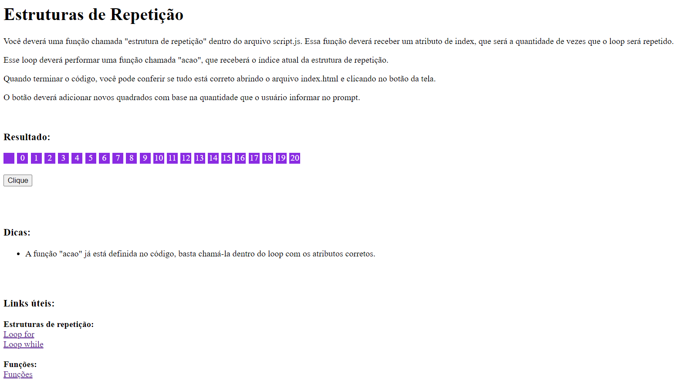

# Módulo 2 - Exercício 1

Você deverá uma função chamada "estrutura de repetição" dentro do arquivo script.js. Essa função deverá receber um atributo de index, que será a quantidade de vezes que o loop será repetido.

Esse loop deverá performar uma função chamada "acao", que receberá o índice atual da estrutura de repetição.

Quando terminar o código, você pode conferir se tudo está correto abrindo o arquivo index.html e clicando no botão da tela.

O botão deverá adicionar novos quadrados com base na quantidade que o usuário informar no prompt.

Depois do usuário clicar no botão e colocar um valor dentro do prompt, o resultado deverá ser o seguinte:

  ### Dicas:
- A função "acao" já está definida no código, basta chamá-la dentro do loop com os atributos corretos.

### Links úteis:
**Estruturas de repetição:**
[Loop for](https://www.w3schools.com/js/js_loop_for.asp)
[Loop while](https://www.w3schools.com/js/js_loop_while.asp)

**Funções:**
[Funções](https://www.w3schools.com/js/js_functions.asp)
